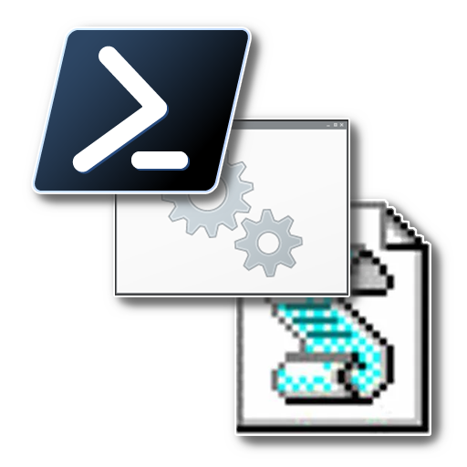

<!--
Template source: https://github.com/Louis3797/awesome-readme-template
-->

  <ul>
    
<h1 style="display: inline-block;">Windows Scripts</h1>

  </ul>
   

 
 
  
  

   A collection of scripts for Windows that help control and perform various functions.  Most scripts are either written as PowerShell scripts or Batch files, with only a few utilitizing VBScript.  
  

  
  
<!-- Badges -->

  
  
  
  
  
  

      
<h4>
    <a href="https://github.com/brad457/WindowsScripts">Documentation</a>
   · 
    <a href="https://github.com/brad457/WindowsScripts/issues/">Report Bug</a>
   · 
    <a href="https://github.com/brad457/WindowsScripts/issues/">Request Feature</a>
  </h4>

 

<!-- Table of Contents -->
